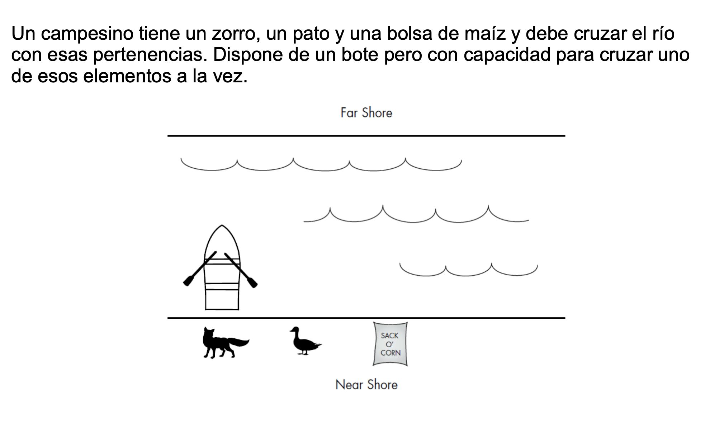
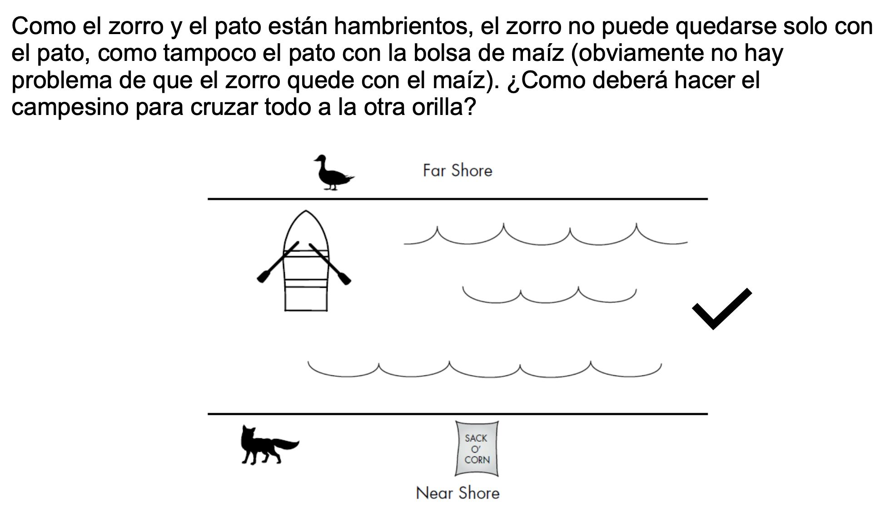
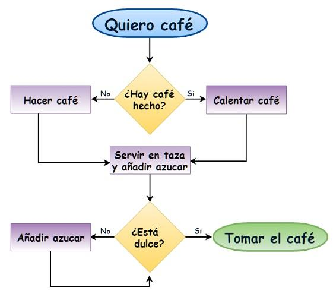
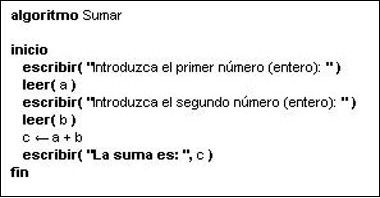
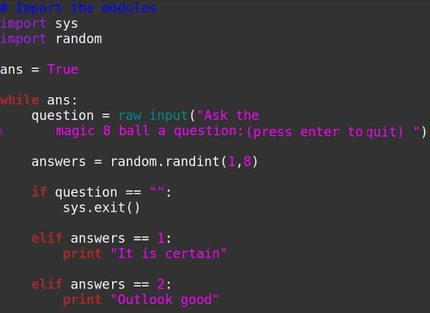

[]{#1}\
Programación 1\
**Introducción a la Programación**\

------------------------------------------------------------------------

[]{#2}Algoritmos\
**Definición**: Secuencia finita y ordenada de pasos que permiten
resolver un problema\
Dados un estado inicial y una entrada, siguiendo los pasos sucesivos se
llega a un estado final \
y se obtiene una solución\
**Descripción**: \
− Nombre \
− Descripción \
− Entradas \
− Salidas \
− Implementación\

------------------------------------------------------------------------

[]{#3}\
Actividad\
3\

------------------------------------------------------------------------

[]{#4}\
Ventajas de la notación Hexa\
4\

------------------------------------------------------------------------

[]{#5}\
Actividad\
5\

------------------------------------------------------------------------

[]{#6}Características\
Características de algoritmos\
• Finitos: número finito de pasos\
• Precisos: sin ambigüedad \
• Determinístico: mismo resultado si se corre dos veces\
6\

------------------------------------------------------------------------

[]{#7}Medios de expresión de un algoritmo\
• Lenguaje natural \
Desde la forma más \
• Diagramas de flujo\
genérica a la forma más \
cercana a un lenguaje que \
• Pseudocódigo \
una computadora \
• Lenguaje de programación\
entiende\
7\

------------------------------------------------------------------------

[]{#8}Lenguaje natural\
Para ir a la ciudad de Colonia desde \
Montevideo lo mejor es tomar la Ruta 1.\
• Fácil\
Primero hay que pasar por la zona \
• Intuitivo\
conocida como "los accesos" a \
Montevideo.\
8\

------------------------------------------------------------------------

[]{#9}Lenguaje natural\
Para ir a la ciudad de Colonia desde \
Montevideo lo mejor es tomar la Ruta 1.\
• Fácil\
Primero hay que pasar por la zona \
• Intuitivo\
conocida como "los accesos" a \
Montevideo.\
• Ambiguo\
Sin embargo, este camino que te \
• Extenso\
enruta por los accesos no es tan \
sencillo si no conocemos su \
distribución, entramado, direcciones de \
conjunción y disyunción, prohibiciones \
según las reglamentaciones vigentes \
que cambian según se esté en la zona \
dependiente de la Dirección Nacional \
de Vialidad correspondiente a rutas \
nacionales o si entramos en un \
poblado regulado por la autoridad \
departamental.\
9\

------------------------------------------------------------------------

[]{#10}\
Diagrama de flujo\
• Representación gráfica de un \
algoritmo \
• Símbolos con significados definidos \
que representan el flujo de \
ejecución \
• Más "estructurado" y "compacto" \
que el lenguaje natural \
10\

------------------------------------------------------------------------

[]{#11}\
Pseudocódigo\
• Descripción informal y compacta de \
alto nivel de un programa \
informático/algoritmo\
• Convenciones estructurales de un \
lenguaje de programación\
• Diseñado para la lectura humana \
• Independencia de cualquier lenguaje \
de programación\
11\

------------------------------------------------------------------------

[]{#12}\
Lenguaje programación\
• Es un lenguaje formal que le \
proporciona al programador, la \
capacidad de escribir (o programar) \
una serie de [instrucciones o \
](https://es.wikipedia.org/wiki/Instrucci%C3%B3n_(inform%C3%A1tica))secuencias
de órdenes en forma \
[de algoritmos](https://es.wikipedia.org/wiki/Algoritmo) con el fin de
controlar \
el comportamiento físico o lógico de \
[un sistema
informático](https://es.wikipedia.org/wiki/Sistema_inform%C3%A1tico).\
• A todo este conjunto de órdenes \
escritas mediante un lenguaje de \
programación se le \
[denomina programa
informático.](https://es.wikipedia.org/wiki/Software)\
12\

------------------------------------------------------------------------
